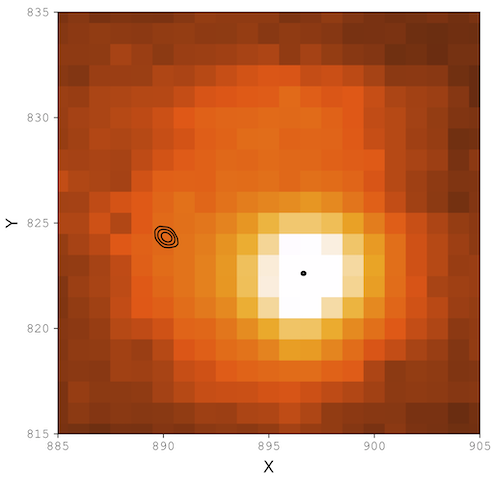
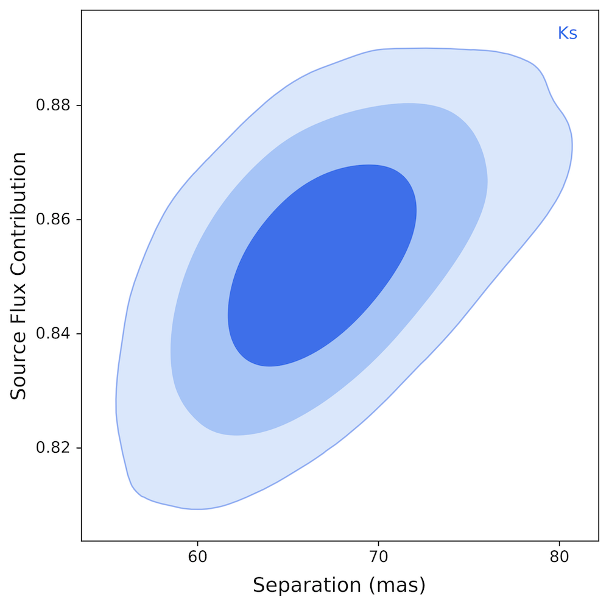

# DAOPHOT-MCMC

DAOPHOT-MCMC is a modified version of the subroutine NSTAR.F which implements a Markov chain Monte Carlo (MCMC) routine for fitting highly blended stellar positions and fluxes. This code is installed and implemented within the overall [DAOPHOT-II](http://www.star.bris.ac.uk/~mbt/daophot/) structure. Detailed descriptions of the major parts of this routine are given in the User's Manual.

Some of the functionality includes:

* 1-star, 2-star, and 3-star PSF fitting.
* Chi^2 minimization to determine best-fit position, separation, flux ratio, and total flux.
* Parameter constraints for best-fit MCMC.

The User's Manual for DAOPHOT-MCMC is updated frequently, and can be found [here](https://github.com/skterry/DAOPHOT-MCMC/blob/master/User_Manual.pdf).

Various MCMC outputs can be seen below:

